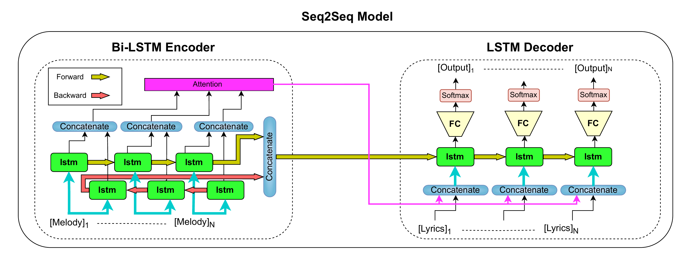

# Deep Learning Assignment 3

## Overview
This project aims to build a recurrent neural network (RNN) for generating lyrics based on provided melodies using MIDI files. The model is trained to predict the next word of the lyrics given the current word and the melody information.


## Structure
- `data/`: Contains MIDI files and lyrics data.
- `src/`: Source code for data preprocessing, model definition, training, and lyric generation.
- `Report.pdf`: Report documenting the approach and results.
- `requirements.txt`: List of required Python packages.

## Instructions
1. Install the required packages:
   ```bash
   pip install -r requirements.txt
   ```

2. Preprocess the data:
   2.1 using lowercase names:
```bash
# Loop through all files in the directory
for file in *; do
  # Check if the file is not already lowercase
  if [ "$file" != "${file,,}" ]; then
    # Rename the file to lowercase
    mv "$file" "${file,,}"
  fi
done
   ```
```bash
    awk -F, '{
        # Output the first two comma-separated fields as they are
        printf "%s,%s", $1, $2;
        
        # Combine the rest of the fields into one, removing additional commas
        rest = "";
        for (i = 3; i <= NF; i++) {
            rest = rest $i;  # Append each field without adding commas
        }
        print "," rest;  # Print the combined rest with a leading comma
    }' input_file > output_file
```
3. model architecture 
### Model Components and Architecture Overview

The `src/model.py` defines a sequence-to-sequence architecture with an LSTM encoder and decoder, integrated through an attention mechanism to effectively generate lyrics based on MIDI file inputs. The encoder processes melody sequences into a context-rich representation, while the decoder, guided by attention weights, predicts lyrics one word at a time. This model leverages attention to focus on relevant parts of the input melody, improving the accuracy and relevance of the generated lyrics.
Certainly! Here’s a brief description of each class and component in the model:
   
   **Attention Class**: Computes the attention weights between the encoder outputs and the decoder's current hidden state to focus on relevant parts of the input sequence for better prediction accuracy.
      
   **lstm_encoder Class**: Encodes the input melody sequence using bidirectional LSTM layers, providing a comprehensive temporal representation of the input for the decoder.
   
   **lstm_decoder Class**: Decodes the encoded melody by integrating the attention mechanism and predicting the next word in the lyrics based on the current context and previous outputs.
   
   **lstm_seq2seq Class**: Orchestrates the overall process by linking the lstm_encoder and lstm_decoder through attention, managing the sequence generation from input melodies to lyric outputs.


4. Train the model:
   ```bash
   python src/main.py --midi_path "/path/to/midi_files" \
                   --lyrics_path "/path/to/lyrics.csv" \
                   --test_path "/path/to/test_set.csv" \
                   --model_save_path "/path/to/save/model" \
                   --writer_path "/path/to/tensorboard/logs" \
                   --input_size_encoder 128 \
                   --hidden_size_encoder 256 \
                   --input_size_decoder 300 \
                   --hidden_size_decoder 512 \
                   --num_layers 2 \
                   --learning_rate 0.001 \
                   --batch_size 4 \
                   --epochs 30 \
                   --melody_strategy "piano_roll" \
                   --teacher_forcing 0.5
   ```
   - **`--midi_path`**: Path to the MIDI files directory.
   - **`--lyrics_path`**: Path to the lyrics CSV file.
   - **`--test_path`**: Path to the test set CSV file.
   - **`--model_save_path`**: Where to save the trained model.
   - **`--writer_path`**: Path for TensorBoard logs.
   - **`--input_size_encoder`**: Input size for the encoder (default: 128).
   - **`--hidden_size_encoder`**: Hidden size of the encoder (default: 256).
   - **`--input_size_decoder`**: Input size for the decoder (default: 300).
   - **`--hidden_size_decoder`**: Hidden size of the decoder (default: 512).
   - **`--num_layers`**: Number of LSTM layers (default: 2).
   - **`--learning_rate`**: Learning rate for the optimizer (default: 0.001).
   - **`--batch_size`**: Batch size for training (default: 4).
   - **`--epochs`**: Number of training epochs (default: 30).
   - **`--melody_strategy`**: Strategy to handle melody information (default: "piano_roll").
   - **`--teacher_forcing`**: Teacher forcing ratio (default: 0.5).


5. Generate lyrics:
  
### Function: get_generated_lyrics
The `get_generated_lyrics` function is designed to generate song lyrics automatically based on provided melody features and initial start words. This function is part of the `generate_lyrics.py` script, which can be executed as described in the project's README file. Here's a breakdown of how this function works and what each parameter means:

#### Parameters:
- **model**: The trained machine learning model used to generate the lyrics.
- **dataloader**: An iterable data loader that provides batches of melody features and target lyrics for evaluation.
- **device**: The computing device (CPU or GPU) where the model calculations are performed.
- **start_words**: A list of initial words or tokens to start the lyric generation. This influences the thematic direction of the generated lyrics.
- **select_strategy** (optional): Strategy used to select words from the model's predictions. Common strategies include 'greedy' for picking the most likely next word, and 'prob' for selecting based on probability distribution which can be adjusted using the `temperature`.
- **temperature** (optional): A factor influencing the randomness of predictions, helping to create more varied and creative lyrics. A higher temperature results in more random outputs.
- **max_length** (optional): Maximum length of the generated lyrics. This limits how long the output for each generated piece will be.

#### Returns:
- **generated_lyrics**: A list of the generated lyrics corresponding to each batch of melody features.
- **targets**: A list of the target lyrics from the dataloader, useful for evaluation and comparison purposes.


6. View the results and analysis in the `src/evaluation.py` file.
The `evaluation.py` script is designed to assess the performance of trained models on generating lyrics. It provides a structured evaluation using several metrics and strategies to understand model effectiveness and areas of potential improvement. Below is a guide on how to utilize the script, the parameters involved, and what to expect from the outputs.
#### Parameters:
To run the script, several parameters need to be specified through the command line:
- `--midi_path`: The directory path containing MIDI files used for generating melodies for lyrics.
- `--test_path`: The path to the CSV file containing the test dataset.
- `--models_save_path`: The directory where trained models are saved, which will be loaded for evaluation.
- `--input_size_encoder`: (Optional) The size of the input layer for the encoder, default is 128.
- `--hidden_size_encoder`: (Optional) The hidden layer size for the encoder, default is 256.
- `--input_size_decoder`: (Optional) The size of the input layer for the decoder, default is 300.
- `--hidden_size_decoder`: (Optional) The hidden layer size for the decoder, default is 512.
- `--num_layers`: (Optional) The number of layers in the LSTM model, default is 2.
- `--output_dir`: (Optional) The directory where the results will be saved, default is "output".

#### Execution:
Run the script using a command similar to:
```bash
python evaluation.py --midi_path /path/to/midis --test_path /path/to/test_set.csv --models_save_path /path/to/models
```

#### Outputs:
The script performs a series of evaluations using different prediction strategies (`prob`, `argmax`, `topk`) and different types of start tokens (`first_word`, `SOS`, `random`). The outputs include:
- **Lyric Predictions**: Generated lyrics for each song in the test set.
- **Target Lyrics**: The original lyrics from the test set for comparison.
- **Jaccard Index Results**: The similarity scores between the predicted and target lyrics, calculated with n-grams of sizes 1 and 2, providing insight into the quality of the lyrics generated.

##### Detailed Results:
Results are saved in text files within the specified output directory, one for each song, detailing the strategy used, the start token, predictions, targets, and Jaccard scores. Additionally, a CSV file summarizing all results can be created for easy review and comparison.

#### Analysis:
The script's output allows for a comprehensive analysis of how well each model and strategy performs in terms of lyric creativity, relevance, and grammatical correctness. This analysis can help in tuning the models and selecting the best strategy for lyric generation based on empirical evidence.


